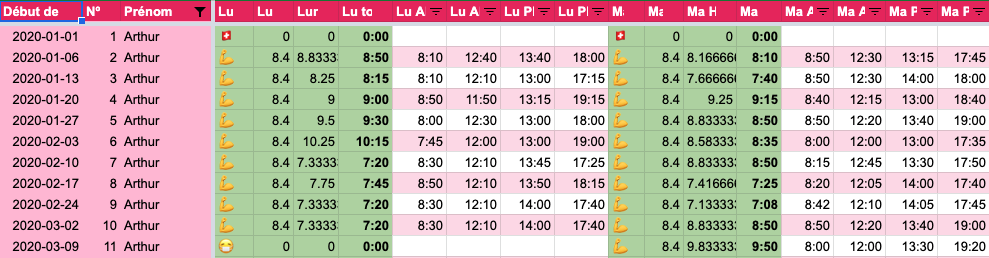
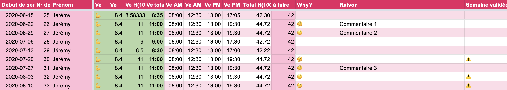

### Analyse de Windmill

Windmill est un système interne à Antistatique qui permet aux collaborateurs d'entrer leurs heures de travail, mais pas que. 

Ils ont plusieurs onglets à l’intérieur de la Google Sheet Windmill qui permettent de gérer, la rentrée des heures de la journée, les heures supplémentaires, les jours de vacances, les absences justifiées, etc. Tout d'abord, la sheet se nommant `saisie-2020` permet d'entrer les heures que les collaborateurs font durant une journée. 

- Les trois premières colonnes contiennent 
  
  - La date du début de semaine
  - Le numéro de la semaine
  - Le prénom du collaborateur
  
- les huit prochaines colonnes contiennent  

  

  - Un émoji définissant le type de jour que c'est 
    - 🇨🇭→ indique que c'est un jour férié 
    - 💪 → indique que la personne a travaillé
    - ✈️ → indique que c'est un jour de congé  
    - 😷 → indique que la personne était malade, ou à armée, ou à la PC. 
      - Défini des absences justifiées du collaborateur
    - 💤 → jour de repos
      - Sera uniquement visible pour les personnes ne travaillant pas à 100%
    - ⚖️ → reprise d'heures supplémentaires
    - 🎓 → jour de formation 
  - Le nombre d'heures à faire durant la journée 
  - Le calcul du nombre d'heures effectuées converties en heure/minutes
  - Le calcul du nombre d'heures effectuées
  - L'heure d'arrivée 
  - L'heure de départ pour la pause de midi 
  - L'heure d'arrivée pour l'après-midi 
  - L'heure de départ en fin de journée  

- Ce schéma se répète jusuqu'à arriver à vendredi 

- À la fin de chaque semaine il y a le décompte du nombres d'heures effectués sur la semaine 

- Et la case suivante le nombre d'heures attendues pour la semaine 

- Dans la case d'arpès il y a un smiley (🤔) qui s'affiche s'il y a une différence de deux heures entre les deux case précédentes 

- Si le smiley s'affiche, il est demandé aux collaborateurs de donner la raison de cette différence 

- La case suivante, elle aussi peut contenir un smiley (⚠️) si la semaine n'est pas valide
  
  - Example, si le smiley du-dessus s'affiche, il faut donner une raison à ce qui s'est passé durant la semaine
  
  
  
- Il y a ensuite d'autres cases après mais elles ne me seront pas utiles, pour ce travail de diplôme
