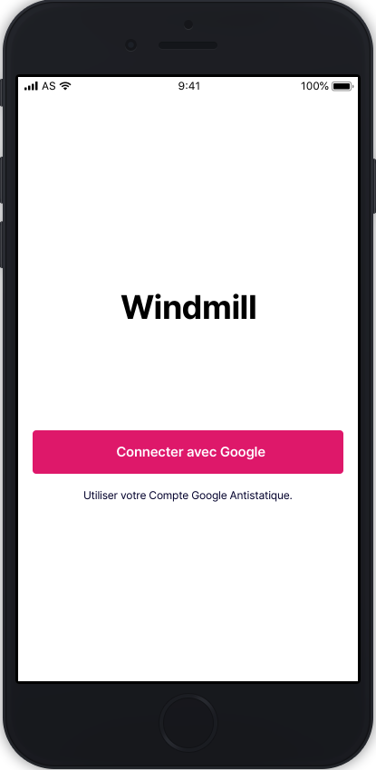

### Analyse des maquettes 

Les maquettes ont été réalisées avec un outil permettant de simuler l'esthétique de l'application. Le rendu a été fait sur `InVision`. Petit apparté sur `InVision`, cette solution permet de faire des maquettes **dynamique**. En sélectionnant une zone cliquable dans une des maquette, nous pouvons faire le lien sur une autre précédemment crée. Vous trouverez un exemple pour le projet Windmill en cliquant sur le lien ci-dessous.

- **https://projects.invisionapp.com/share/YUW7TQED8NH#/screens/382262866_LOGIN**

Un écran desktop a été pensé, dans le même style que pour la vue mobile.

- **https://invis.io/U7UPNE3BV4W#/383193247_Windmill**

Voici la page de login. Page essentiel afin d'accéder aux autres pages de l'application. 

La conexion se fera à l'aide du service de Google. Les personnes ayant un compte avec une adresse mail **Antistatique** pouront se connecter et accèder à la Sheet, s'ils y ont accès. Normalement, il n'y aura aucun problème à ce niveau-là puisque tous les collaborateurs y ont accès. 

Une fois connecté, les utilisateurs arriveront sur la page d'accueil ressemblant à l'illustration ci-dessous. 

Nous avons une première partie qui servira à naviguer entre les semaines de l'année. Juste en-dessous, nous trouverons le total d'heures attendus pour la semaine et le total d'heure effectué par le collaborateur. Le bouton `Justifier les heures` et le smiley apparaitront uniquement s'il y a une différence de plus ou moins de deux heures entre ces deux nombres. Lié à l'action de déplacement dans les semaines, nous aurons les dates des jours qui changeront également. Les heures aussi changeront en fonction des valeurs entrées. Les colaborateurs auront deux parties, une pour le matin et une pour l'après-midi. À chaque fois pour informer quand ils commencent et quand ils terminent.

De plus, quatre fonctionnalités se trouveront en fin de page. La première servira à mettre un horaire habituel, par exemple 08:00 - 12:30 et 13:00 - 17:00. La deuxième et troisième permettront d'ajouter ou enlever des heures aux heures déjà entrées. Pour finir, un bouton servira à vider tous les champs du jour.

Voilà un petit apperçu avec des données entrées.

Il y aura aussi une partie dashboard qui ressemblera à ça. 

Cette partie dashboard permettra aux collaborateurs d'avoir une vue d'ensemble sur leurs informations personnelles. Notamment avec une séction dédiée aux jours de congés et aux heures supplémentaires. Le nombre de jours de vacances posés ainsi que les heurs supplémentaires déjà récupérées. Enfin, une partie à titre indicative, avec le nombre de jour où ils ont été malade, le nombre de jour où ils ont été en formation et le budjet restant pour ces jours-là.
